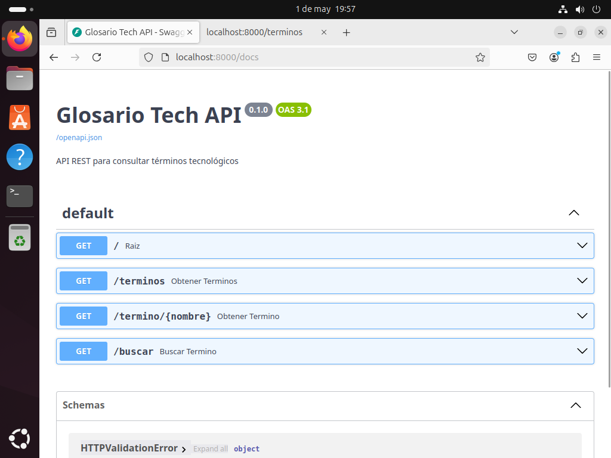
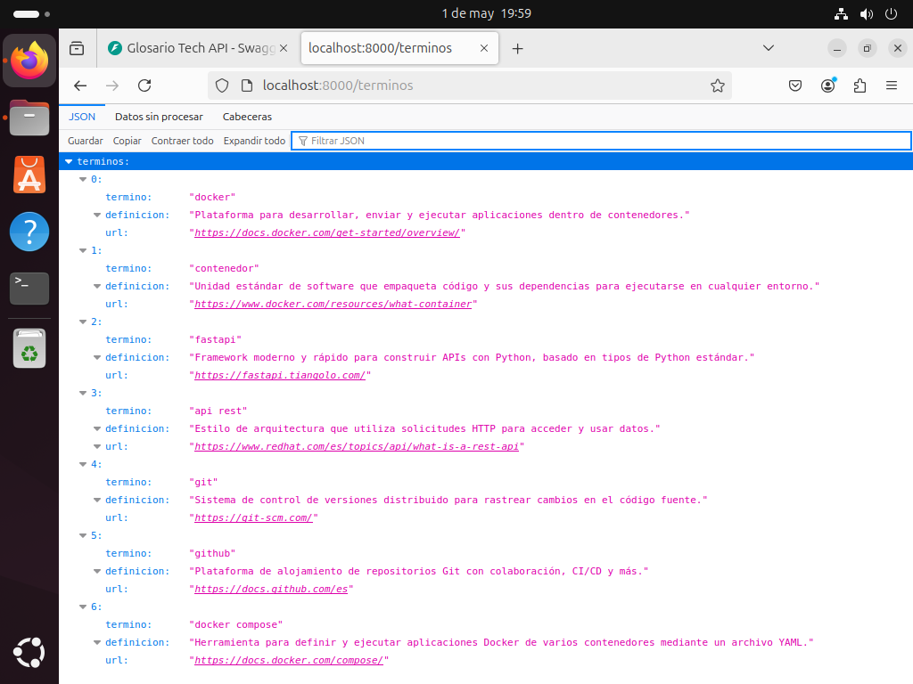
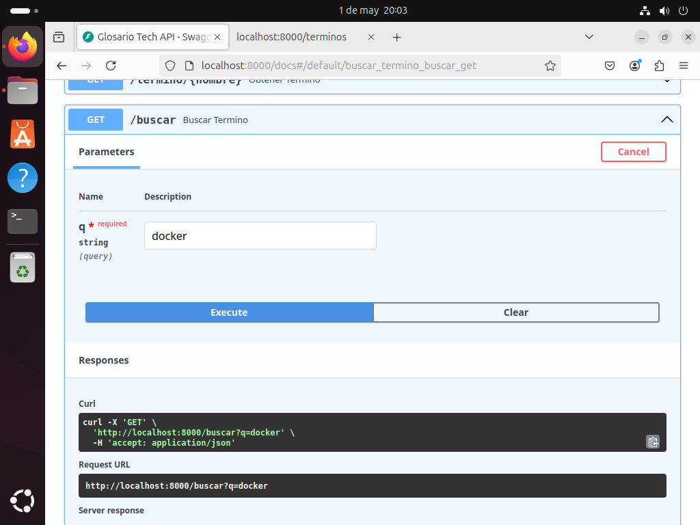
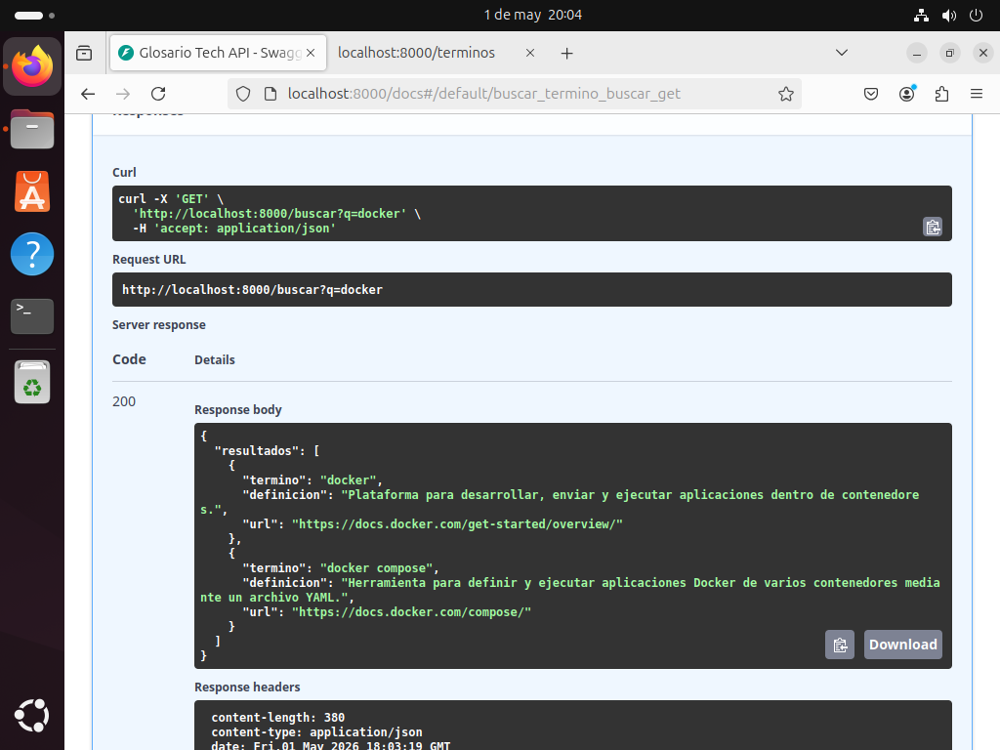

# Glosario Tech API

API REST con **FastAPI** para consultar definiciones de términos tecnológicos.  
El proyecto está contenerizado con **Docker** y orquestado con **Docker Compose**, siguiendo un flujo de trabajo profesional con **Git** y **GitHub**.

---

## 📖 Descripción del proyecto

La aplicación expone varios endpoints para consultar un glosario de términos sobre tecnologías (Docker, Git, FastAPI, etc.). Los datos se almacenan en un archivo `glosario.json` y se sirven mediante una API REST documentada automáticamente con Swagger.

**Tecnologías utilizadas**:
- Python 3.11
- FastAPI
- Uvicorn
- Docker & Docker Compose

---

## 🚀 Instrucciones de instalación y despliegue

### Requisitos previos
- Tener instalado [Docker](https://docs.docker.com/get-docker/) y [Docker Compose](https://docs.docker.com/compose/install/).
- (Opcional) Git para clonar el repositorio.

### Paso 1: Clonar el repositorio

```bash
git clone git@github.com:AdolfoLahozPerez/Proyecto-Final-Integrador-docker.git
cd Proyecto-Final-Integrador-docker
Paso 2: Construir la imagen (opcional, Compose lo hace automáticamente)
bash
docker build -t glosario-tech-api .
Paso 3: Levantar los servicios con Docker Compose
bash
docker compose up -d --build
El flag -d ejecuta el contenedor en segundo plano. Si prefieres ver los logs en tiempo real, omite -d.

###Paso 4: Acceder a la aplicación

La API queda expuesta en el puerto 8000. Puedes probarla desde el navegador o con curl:

Documentación Swagger: http://localhost:8000/docs

Raíz: http://localhost:8000/

Todos los términos: GET /terminos

Término específico: GET /termino/{nombre} (ej. /termino/docker)

Búsqueda: GET /buscar?q=palabra

###Paso 5: Detener los servicios

```bash
docker compose down

##🐳 Explicación de los archivos Docker

Dockerfile
dockerfile
FROM python:3.11-slim
WORKDIR /app
COPY requirements.txt .
RUN pip install --no-cache-dir -r requirements.txt
COPY app/ app/
EXPOSE 8000
CMD ["uvicorn", "app.main:app", "--host", "0.0.0.0", "--port", "8000"]
FROM python:3.11-slim: Imagen base ligera de Python.

WORKDIR /app: Directorio de trabajo dentro del contenedor.

COPY requirements.txt . y RUN pip install...: Instala las dependencias (FastAPI, Uvicorn).

COPY app/ app/: Copia el código fuente (main.py) y los datos (glosario.json) al contenedor.

EXPOSE 8000: Documenta el puerto en el que escucha la aplicación.

CMD: Comando de inicio con Uvicorn, indicando host=0.0.0.0 para aceptar conexiones externas.

docker-compose.yml
yaml
version: '3.8'
services:
  glosario-api:
    build: .
    container_name: glosario-tech-api
    ports:
      - "8000:8000"
    volumes:
      - ./app/glosario.json:/app/app/glosario.json
    restart: unless-stopped
build: .: Construye la imagen a partir del Dockerfile del directorio actual.

ports: Mapea el puerto 8000 del host al 8000 del contenedor.

volumes: Monta el archivo JSON del glosario en el contenedor. Así los cambios que hagas localmente se reflejan en tiempo real sin reconstruir la imagen (persistencia de datos).

restart: unless-stopped: El contenedor se reinicia automáticamente si falla, a menos que lo detengas manualmente.

(Opcional) Se puede añadir un servicio mongo si se desea migrar la base de datos a MongoDB (ver sección de extras).

###🔧 Posibles problemas y soluciones

El puerto 8000 ya está ocupado
Cambia el mapeo en docker-compose.yml a "8001:8000" y accede desde http://localhost:8001.

Error "Cannot connect to the Docker daemon"
Asegúrate de que Docker esté corriendo (sudo systemctl start docker) y de que tu usuario pertenezca al grupo docker (sudo usermod -aG docker $USER).

Los cambios en glosario.json no se reflejan
Verifica que la ruta del volumen en docker-compose.yml sea correcta. Reinicia el contenedor con docker compose restart.

Error "Permission denied" al acceder al socket de Docker
Cierra sesión y vuelve a entrar, o ejecuta newgrp docker para aplicar los cambios de grupo.

###✨ Contribuciones y organización del proyecto con ramas

El flujo de trabajo sigue el modelo simplificado de Git Flow:

main: Código estable y desplegable.

develop: Rama de integración donde se fusionan las nuevas características.

feature/<nombre>: Ramas temporales para cada funcionalidad (ej. feature/glosario, feature/documentacion).

Procedimiento típico:

Crear una rama feature/xxx desde develop.

Desarrollar y hacer commits descriptivos.

Subir la rama (git push -u origin feature/xxx).

Crear un Pull Request hacia develop en GitHub.

Revisar y fusionar el PR.

Cuando develop esté listo para producción, crear PR de develop a main y fusionar.

Este flujo garantiza que main siempre contenga una versión probada y estable de la aplicación.

###📂 Estructura final del repositorio

Proyecto-Final-Integrador-docker/
├── app/
│   ├── main.py
│   └── glosario.json
├── Dockerfile
├── docker-compose.yml
├── requirements.txt
└── README.md

### Pruebas de funcionamiento

### Documentación Swagger


### Glosario de términos


### Búsqueda de términos


### Resultado



###🌟 Extras opcionales 

Base de datos externa: Añadir un servicio mongo en docker-compose.yml y conectar FastAPI con motor o pymongo.

Variables de entorno: Utilizar un archivo .env para configurar el puerto o la ruta del JSON.

Tests automatizados: Incorporar pytest y ejecutarlos en el CI.

CI/CD con GitHub Actions: Construir la imagen Docker automáticamente en cada push a main.

_Este proyecto cumple con todos los requisitos del Proyecto Integrador._
Realizado a través de CAMPUS VDI.

###Autor: Adolfo Lahoz Pérez
###Repositorio: Proyecto Final Integrador Docker

